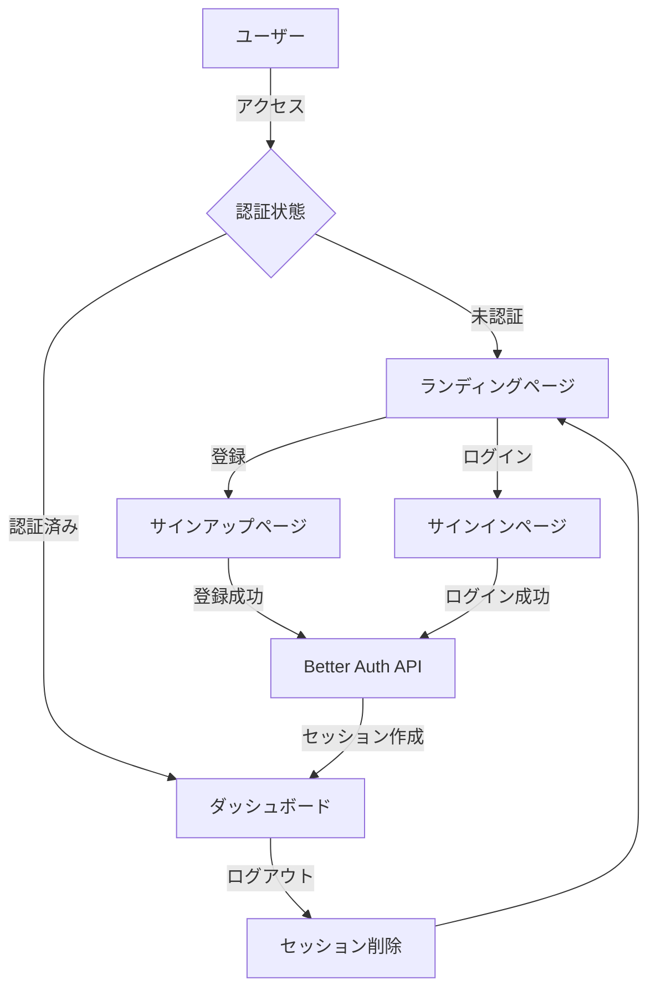

# 🔐 Better Auth Sample

<div align="center">

**Next.js 16 + Better Auth + Shadcn UI による型安全な認証システム**

[](https://nextjs.org/)
[](https://www.typescriptlang.org/)
[](https://www.better-auth.com/)
[](https://bun.sh/)

[デモを見る](#) | [ドキュメント](#セットアップ) | [バグ報告](https://github.com/your-repo/issues)

</div>

---

## 📋 目次

- [概要](#-概要)
- [技術スタック](#-技術スタック)
- [主な機能](#-主な機能)
- [プロジェクト構成](#-プロジェクト構成)
- [セットアップ](#-セットアップ)
- [開発](#-開発)
- [デプロイ](#-デプロイ)
- [アーキテクチャ](#-アーキテクチャ)
- [環境変数](#-環境変数)

---

## 🎯 概要

このプロジェクトは、**Better Auth**を使用したモダンな認証システムのリファレンス実装です。Next.js 16の最新機能（Server Components、React Compiler等）を活用し、型安全かつパフォーマンスに優れた認証フローを実現しています。

### なぜこのプロジェクトか？

- ✅ **プロダクション対応**: セキュアな認証実装のベストプラクティス
- ✅ **最新技術**: Next.js 16 + React 19 + TypeScript 5.9
- ✅ **開発体験**: React Compiler、型推論、Hot Reload
- ✅ **美しいUI**: Shadcn UIによるアクセシブルなコンポーネント

---

## 🛠 技術スタック

### コア

| 技術 | バージョン | 用途 |
|------|-----------|------|
| [Next.js](https://nextjs.org/) | 16.0.1 | Reactフレームワーク |
| [React](https://react.dev/) | 19.2.0 | UIライブラリ |
| [TypeScript](https://www.typescriptlang.org/) | 5.9.3 | 型安全な開発 |
| [Bun](https://bun.sh/) | 1.3+ | 高速なJavaScriptランタイム |

### 認証

| 技術 | バージョン | 用途 |
|------|-----------|------|
| [Better Auth](https://www.better-auth.com/) | 1.3.34 | 認証ライブラリ |
| [Better SQLite3](https://github.com/WiseLibs/better-sqlite3) | 12.4.1 | データベース |

### UI/スタイリング

| 技術 | バージョン | 用途 |
|------|-----------|------|
| [Shadcn UI](https://ui.shadcn.com/) | - | UIコンポーネント |
| [Tailwind CSS](https://tailwindcss.com/) | 4.1.16 | CSSフレームワーク |
| [Lucide React](https://lucide.dev/) | 0.548.0 | アイコンライブラリ |

### フォーム管理

| 技術 | バージョン | 用途 |
|------|-----------|------|
| [React Hook Form](https://react-hook-form.com/) | 7.65.0 | フォーム管理 |
| [Zod](https://zod.dev/) | 4.1.12 | スキーマバリデーション |

### 開発ツール

| 技術 | バージョン | 用途 |
|------|-----------|------|
| [ESLint](https://eslint.org/) | 9.38.0 | Linter |
| [Prettier](https://prettier.io/) | 3.6.2 | コードフォーマッター |
| [React Compiler](https://react.dev/learn/react-compiler) | 1.0.0 | パフォーマンス最適化 |

---

## ✨ 主な機能

### 認証機能

- 🔐 **Email & Password認証**: セキュアなパスワードハッシュ化
- 👤 **ユーザー登録**: バリデーション付き新規登録フロー
- 🔑 **ログイン/ログアウト**: セッション管理
- 🛡️ **ルート保護**: 認証状態に基づくアクセス制御
- 🔄 **自動リダイレクト**: 認証状態に応じた適切なページ遷移

### UI/UX

- 📱 **レスポンシブデザイン**: モバイル・タブレット・デスクトップ対応
- 🎨 **モダンなUI**: Shadcn UIによる美しいコンポーネント
- ♿ **アクセシビリティ**: ARIA属性、キーボードナビゲーション対応
- 🌙 **ダークモード対応**: システム設定に追従（実装予定）

### 開発体験

- ⚡ **高速ビルド**: Turbopack + Bun
- 🔥 **Hot Reload**: 即座に変更を反映
- 📝 **型安全**: エンドツーエンドの型推論
- 🚀 **React Compiler**: 自動メモ化による最適化

---

## 📁 プロジェクト構成

```
privy-better-auth-sample/
├── src/
│   ├── app/                          # App Router
│   │   ├── (auth)/                   # 認証関連ページグループ
│   │   │   ├── sign-in/              # ログインページ
│   │   │   │   └── page.tsx
│   │   │   └── sign-up/              # 新規登録ページ
│   │   │       └── page.tsx
│   │   ├── api/                      # API Routes
│   │   │   └── auth/                 # Better Auth API
│   │   │       └── [...all]/
│   │   │           └── route.ts      # 認証エンドポイント
│   │   ├── dashboard/                # ダッシュボード（保護ページ）
│   │   │   └── page.tsx
│   │   ├── layout.tsx                # ルートレイアウト
│   │   ├── page.tsx                  # ランディングページ
│   │   └── globals.css               # グローバルスタイル
│   │
│   ├── components/                   # Reactコンポーネント
│   │   ├── auth/                     # 認証関連コンポーネント
│   │   │   ├── sign-in-form.tsx     # ログインフォーム
│   │   │   ├── sign-out-button.tsx  # ログアウトボタン
│   │   │   └── sign-up-form.tsx     # 新規登録フォーム
│   │   ├── layout/                   # レイアウトコンポーネント
│   │   │   └── header.tsx            # ヘッダー
│   │   └── ui/                       # Shadcn UIコンポーネント
│   │       ├── button.tsx
│   │       ├── card.tsx
│   │       ├── form.tsx
│   │       ├── input.tsx
│   │       └── label.tsx
│   │
│   └── lib/                          # ライブラリ・ユーティリティ
│       ├── auth.ts                   # Better Auth設定（サーバー）
│       ├── auth-client.ts            # Better Authクライアント
│       └── utils.ts                  # ユーティリティ関数
│
├── public/                           # 静的ファイル
├── components.json                   # Shadcn UI設定
├── next.config.ts                    # Next.js設定
├── tailwind.config.ts                # Tailwind CSS設定
├── tsconfig.json                     # TypeScript設定
├── package.json                      # 依存関係
├── bun.lockb                         # Bunロックファイル
└── README.md                         # このファイル
```

### ディレクトリ規約

- **`(auth)/`**: Route Groupを使用した認証ページの論理的なグループ化
- **`components/auth/`**: 認証関連のClient Components
- **`components/layout/`**: レイアウト用のServer Components
- **`components/ui/`**: Shadcn UIの再利用可能なコンポーネント
- **`lib/`**: ビジネスロジック、ユーティリティ、設定

---

## 🚀 セットアップ

### 前提条件

- **Bun** 1.3以上
- **Node.js** 22以上（Bunを使用する場合は不要）

### インストール

```bash
# リポジトリをクローン
git clone https://github.com/your-username/privy-better-auth-sample.git
cd privy-better-auth-sample

# 依存関係をインストール
bun install
```

### 環境変数の設定

`.env.local`ファイルを作成し、以下の環境変数を設定：

```bash
# Better Auth設定
BETTER_AUTH_SECRET=your-secret-key-here  # 以下のコマンドで生成
BETTER_AUTH_URL=http://localhost:3000    # 開発環境のURL
```

シークレットキーの生成：

```bash
openssl rand -base64 32
```

### データベースの初期化

SQLiteデータベースは初回起動時に自動的に作成されます。

```bash
# 開発サーバーを起動（データベースが自動作成される）
bun run dev
```

---

## 💻 開発

### 開発サーバーの起動

```bash
bun run dev
```

ブラウザで [http://localhost:3000](http://localhost:3000) を開きます。

### ビルド

```bash
bun run build
```

### 本番環境での実行

```bash
bun run start
```

### Lintとフォーマット

```bash
# Lint実行
bun run lint

# コードフォーマット
bun run format
```

---

## 🌐 デプロイ

### Vercel（推奨）

[](https://vercel.com/new/clone?repository-url=https://github.com/your-username/privy-better-auth-sample)

1. Vercelにリポジトリを接続
2. 環境変数を設定：
   - `BETTER_AUTH_SECRET`
   - `BETTER_AUTH_URL`（本番環境のURL）
3. デプロイ

### その他のプラットフォーム

- **Netlify**: `next build` → `next start`
- **Railway**: Node.js環境で自動デプロイ
- **Cloudflare Pages**: 静的エクスポートまたはEdge Runtime

**注意**: Better AuthはSQLiteを使用しているため、ファイルシステムへの書き込みが必要です。本番環境では、PostgreSQLやMySQLへの移行を推奨します。

---

## 🏗 アーキテクチャ

### 認証フロー



### コンポーネント構成

```
┌─────────────────────────────────────────┐
│           RootLayout (Server)           │
│  ┌───────────────────────────────────┐  │
│  │      Header (Server)              │  │
│  │  ┌─────────────────────────────┐  │  │
│  │  │  SignOutButton (Client)     │  │  │
│  │  └─────────────────────────────┘  │  │
│  └───────────────────────────────────┘  │
│                                         │
│  ┌───────────────────────────────────┐  │
│  │      Page Content (Server)        │  │
│  │  ┌─────────────────────────────┐  │  │
│  │  │  SignInForm (Client)        │  │  │
│  │  │  SignUpForm (Client)        │  │  │
│  │  └─────────────────────────────┘  │  │
│  └───────────────────────────────────┘  │
└─────────────────────────────────────────┘
```

### データフロー

1. **認証リクエスト**: Client Component → Better Auth API
2. **セッション管理**: Better Auth → SQLite
3. **認証チェック**: Server Component → Better Auth → Cookie
4. **リダイレクト**: Server Component → Next.js Navigation

### セキュリティ

- ✅ **パスワードハッシュ化**: bcryptによる安全なハッシュ化
- ✅ **CSRF保護**: Better Auth組み込みの保護機能
- ✅ **セッション管理**: HTTPOnly Cookieによるセキュアなセッション
- ✅ **XSS対策**: Reactの自動エスケープ
- ✅ **型安全**: TypeScriptによるコンパイル時チェック

---

## 🔧 環境変数

| 変数名 | 必須 | 説明 | デフォルト値 |
|--------|------|------|-------------|
| `BETTER_AUTH_SECRET` | ✅ | セッション暗号化キー（32文字以上推奨） | - |
| `BETTER_AUTH_URL` | ✅ | アプリケーションのベースURL | `http://localhost:3000` |

### 環境別設定

```bash
# 開発環境 (.env.local)
BETTER_AUTH_SECRET=dev-secret-key-change-in-production
BETTER_AUTH_URL=http://localhost:3000

# 本番環境 (Vercel等)
BETTER_AUTH_SECRET=<openssl rand -base64 32で生成>
BETTER_AUTH_URL=https://your-domain.com
```

---

## 📚 主要な技術的決定

### なぜBetter Authか？

- ✅ **型安全**: TypeScript完全対応
- ✅ **柔軟性**: カスタマイズ可能なAPI
- ✅ **モダン**: React Server Components対応
- ✅ **軽量**: 最小限の依存関係

### なぜServer Componentsか？

- ✅ **パフォーマンス**: クライアントバンドルサイズの削減
- ✅ **セキュリティ**: サーバーサイドでの認証チェック
- ✅ **SEO**: サーバーサイドレンダリング
- ✅ **データフェッチ**: 直接データベースアクセス

### なぜMiddlewareを使わないか？

- ❌ **Edge Runtime制約**: SQLiteがEdge Runtimeで動作しない
- ✅ **代替案**: ページレベルでの認証チェック（Server Components）
- ✅ **メリット**: よりシンプルで理解しやすいコード

---

## 🤝 コントリビューション

プルリクエストを歓迎します！大きな変更の場合は、まずIssueを開いて変更内容を議論してください。

### 開発フロー

1. このリポジトリをフォーク
2. フィーチャーブランチを作成 (`git checkout -b feature/amazing-feature`)
3. 変更をコミット (`git commit -m 'Add some amazing feature'`)
4. ブランチにプッシュ (`git push origin feature/amazing-feature`)
5. プルリクエストを作成

---

## 📝 ライセンス

このプロジェクトは[MIT License](LICENSE)の下でライセンスされています。

---

## 🙏 謝辞

- [Better Auth](https://www.better-auth.com/) - 素晴らしい認証ライブラリ
- [Shadcn UI](https://ui.shadcn.com/) - 美しいUIコンポーネント
- [Next.js](https://nextjs.org/) - 最高のReactフレームワーク
- [Vercel](https://vercel.com/) - シームレスなデプロイ体験

---

<div align="center">

**⭐ このプロジェクトが役に立ったら、スターをつけてください！**

Made with ❤️ by [Your Name](https://github.com/your-username)

</div>
